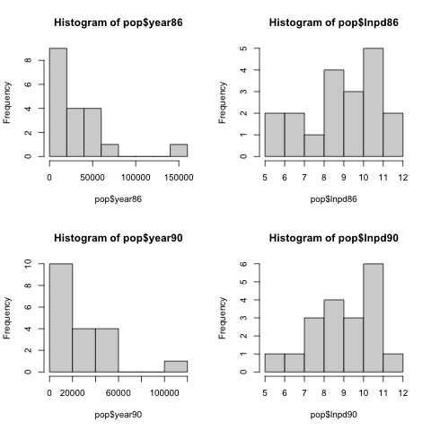
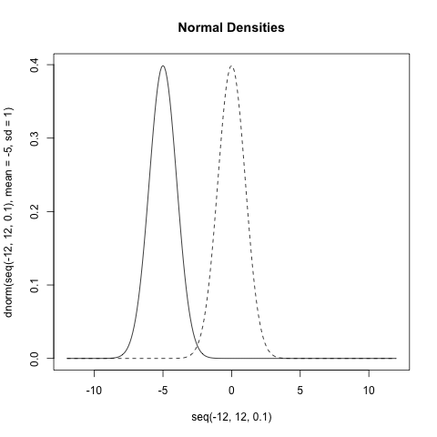
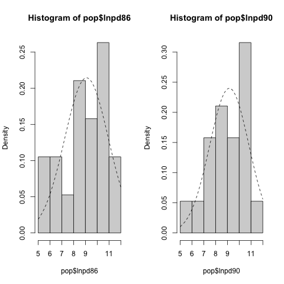
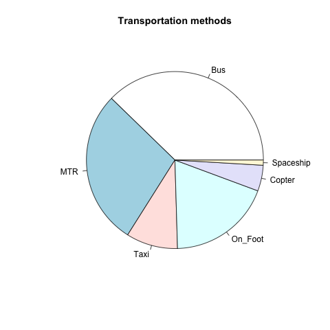
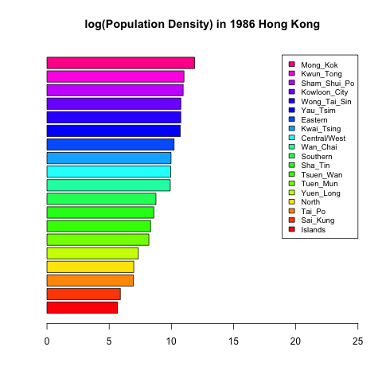

# Chapter 3 Markdowns
By @TNTprizz80315

# Data Visualization
We went through some of the examples in the previous chapters, like Scatter plot graph.  
In this chapter, we will go through some frequently-used charts.

The functions used to draw the plots are considered "high level", that is, we don't have to worry about where the pixels go. We can get the graph by simply describing the plot we want.

In the following examples, we will use the following source files:  

[popden1.dat](./popden1.dat)  
[Commutating.dat](./Commutating.dat)  
```R
pop <- read.table("./popden1.dat", stringsAsFactors = TRUE, header = TRUE)
com <- read.table("./Commutating.dat", stringsAsFactors = TRUE, header = TRUE)
```

## Multi-frame graphics
If we want to render multiple charts in a go, we can use the following function:

`par(**kwargs)` *You may use `help(par)` to view all the parameters of a function.*  

`mfrow` `mfcol` Takes a vector as input, states the dimention of the frame.  
Use `mfrow` if you want to fill the frame row by row and vice versa.
___
For example, to create a 2x2 frame:  
```r
par(mfrow = c(2, 2))
# Produces 4 random charts
hist(pop$year86)
hist(pop$lnpd86)
hist(pop$year90)
hist(pop$lnpd90)
```
Output:  


## Adding a line
You can add lines into a chart after rendering a chart.

`lines(x, y, **kwargs)`

`lty` Takes integer or string as input. Determines the line type.
> 0=blank, 1=solid (default), 2=dashed, 3=dotted, 4=dotdash, 5=longdash, 6=twodash  
*--help(par)*  

`lwd` Takes integer as input. Determines the width of the rendered line.
___
Making a dashed line following normal distribution under a random chart:
```r
plot(seq(-12, 12, 0.1), dnorm(seq(-12, 12, 0.1), mean = -5, sd = 1), type = "l", main = "Normal Densities")
lines(seq(-12, 12, 0.1), dnorm(seq(-12, 12, 0.1), mean = 0, sd = 1), lty = 2)
```
Output:  


## Histogram
This is a commonly used chart type used to describe the distribution of the data.

`hist(data, **kwargs)`

`freq` Takes boolean as input. If `FALSE`, make a histogram with density instead of frequency.  
`main` Takes string as input. Sets the title of the histogram.  
___
Let's put a normal density line onto the histogram of `lnpd86` and `lnpd90`:
```r
par(mfrow = c(1, 2))
NRange <- seq(5, 12, 0.1)
hist(pop$lnpd86, freq = FALSE)
lines(NRange, dnorm(NRange, mean(pop$lnpd86), sd(pop$lnpd86)), lty = 2)
hist(pop$lnpd90, freq = FALSE)
lines(NRange, dnorm(NRange, mean(pop$lnpd90), sd(pop$lnpd90)), lty = 2)
```
Output:  


## Pie chart
Yet another commonly used chart type when we want to compare the number of different groups.

`pie(data, **kwargs)`

`labels` Takes a heading as input. Will label the corresponding part of the chart using those.  
`cex` Character expansion factor. Sets the size of the text in the chart.  
`main` Takes string as input. Sets the title of the histogram.  
___
Let's compare the number of people using different transportation methods:
```r
pie(com$Count, labels = com$Commutating, main = "Transportation methods")
```
Output:  


## Bar chart
Effective in comparing different categories.

`barplot(data, **kwargs)`

`horiz` Boolean. Produces a horizontal bar if `TRUE`.  
`col` Takes a colour scheme as input. Colours the bar in the specified colour scheme.  
`xlim` `ylim` Take vectors as input. Define the limits of the data shown in the chart.
___
Let's compare the population distribution with a coloured bar chart:
```r
barplot(pop$lnpd86, horiz = TRUE, col = rainbow(20), xlim=c(0, 25), 
    legend.text = pop$district, 
    args.legend = list(x = 25, y = 23, cex = 0.8),
    main = "log(Population Density) in 1986 Hong Kong"
)
```
Output:  

___
How about adding a fancy legend inside the bar and number at the end?
```r
y <- barplot(pop$lnpd90, horiz = TRUE, 
    col = "white", xlim = c(0, 15), 
    main = "log(Population Density) in 1990 Hong Kong"
) # Obtain the y coordinates of each bar generated
x <- round(pop$lnpd90, 1) # Obtain the x coordinates of each data
text(0.5 * x, y, pop$district, cex = 0.8)
text(0.8 + x, y, labels = x, cex = 0.8)
```
Output:  


## Grouped bar chart
*Lazy TNTprizz decided to do the rest of the things after the next lecture.*